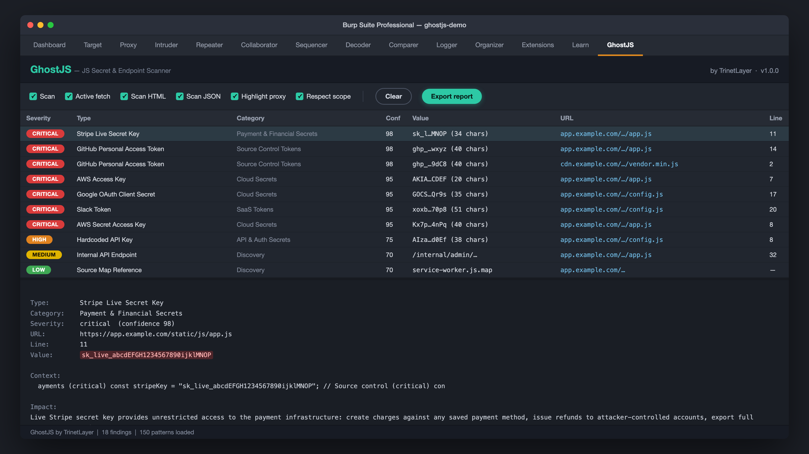

<div align="center">

# 👻 GhostJS

### Find hardcoded secrets & hidden endpoints in JavaScript — right inside Burp Suite.

A Burp Suite extension by **[TrinetLayer](https://github.com/trinetlayer)** that passively
scans every JavaScript, HTML, and JSON response for **150+ kinds of secrets** (API keys,
tokens, cloud credentials, private keys) and maps hidden **API endpoints** — automatically,
as you browse.

`Java` · `Montoya API` · `150+ detection patterns` · `zero config`

</div>

---

## What it does

- **150+ secret patterns** — AWS / GCP / Azure keys, Stripe / PayPal / Razorpay, GitHub &
  GitLab tokens, JWTs, Firebase, Slack, private keys, database URIs, and more.
- **Endpoint discovery** — pulls API paths, cloud-storage URLs, and source-map references
  out of JS to expand your attack surface.
- **Automatic & passive** — scans traffic already flowing through Burp. No buttons to press.
- **Active fetch** — grabs `<script src>` bundles a page references but didn't load, and
  scans those too, replaying your live session cookies.
- **Smart, low-noise** — a false-positive filter suppresses doc samples, placeholders, and
  public-by-design keys, so you see real findings.
- **Highlights in Proxy history** plus a dedicated **GhostJS tab** with impact, remediation,
  and one-click Markdown export.
- **Non-blocking** — large bundles are scanned in the background; your browsing never lags.

---

## Screenshot

> Load the extension, browse a target, and the **GhostJS** tab fills with findings — rendered
> in a clean, modern flat UI with colour-coded severity badges.



Real GhostJS output from the bundled [test target](#try-it-in-2-minutes) (all secrets fake,
hostnames swapped for `example.com`):

- **GhostJS tab** — toolbar toggles, then one row per unique secret with a rounded severity
  badge, type, category, confidence (0–100), masked value, URL and line. 8 CRITICAL rows here:
  AWS access + secret keys, Stripe live key, two GitHub PATs, Slack token, Google OAuth secret.
- **Detail pane** — click a row to see the full value, the surrounding code, a plain-English
  impact statement and numbered remediation steps. The table itself never prints a full
  secret (`sk_l…MNOP`).
- **Proxy history highlighting** — the same responses are coloured in Burp's HTTP history by
  worst severity (red = critical/high, orange = medium, yellow = low, gray = info) with a
  `GhostJS: N finding(s)` note, so you spot leaky bundles without leaving Proxy.
- **Discovery rows** (LOW/INFO) — source-map reference, S3 URL, and API paths pulled from the
  JS. These are references, not probed endpoints; see [Scope](#scope--responsible-use).
- **Zero noise** — `js/placeholders.js` (AWS doc samples, a Stripe *publishable* key, i18n
  strings) produced no rows: the false-positive filter dropped every one of them.

---

## Quick start

### Requirements
- **Burp Suite** (Community or Professional)
- **JDK 17+** — only needed if you build from source ([Temurin](https://adoptium.net/) works)

### Option A — Download the ready-made jar (easiest)
1. Grab `ghostjs.jar` from the [**Releases**](https://github.com/trinetlayer/Ghost-Js-Burp-Extension/releases) page.
2. In Burp: **Extensions ▸ Installed ▸ Add**
3. **Extension type:** `Java` → **Select file:** `ghostjs.jar` → **Next**
4. Done — a **GhostJS** tab appears. Start browsing your target.

### Option B — Build from source
```bash
git clone https://github.com/trinetlayer/Ghost-Js-Burp-Extension.git
cd Ghost-Js-Burp-Extension
./build.sh          # downloads the Montoya API, compiles, packages dist/ghostjs.jar
```
No Gradle or Maven required — `build.sh` handles everything. Then load `dist/ghostjs.jar`
in Burp as in Option A.

---

## Try it in 2 minutes

The repo ships a test target seeded with **fake, format-valid** secrets so you can see
GhostJS work (and take that screenshot):

```bash
./test-site/serve.sh          # serves http://localhost:8000
```
1. Load `dist/ghostjs.jar` in Burp.
2. Open Burp's browser: **Proxy ▸ Intercept ▸ Open Browser**.
3. Visit `http://localhost:8000/`.
4. Open the **GhostJS** tab → ~18 findings across every severity. The samples in
   `placeholders.js` are correctly ignored, proving the false-positive filter works.

---

## Controls (GhostJS tab toolbar)

| Toggle | What it does |
|---|---|
| **Scan** | Master on/off for passive scanning |
| **Active fetch** | Fetch referenced `.js` bundles not seen in proxy |
| **Scan HTML** | Also scan HTML bodies (inline secrets) |
| **Scan JSON** | Also scan JSON API responses |
| **Highlight proxy** | Colour matching entries in Proxy history |
| **Respect scope** | Only active-fetch in-scope / same-host URLs |
| **Clear** | Empty the findings table |
| **Export report** | Save all findings as Markdown |

Click any finding to see its **value, impact, and remediation**.

---

## How it works

```
HTTP response ─► GhostJS (passive)
                   ├─ JS / HTML / JSON?
                   │     ├─ small body → scan inline → highlight the proxy row
                   │     └─ large body → background scan pool (browsing never blocks)
                   ├─ HTML? → extract <script src>/*.js → active-fetch + scan (with cookies)
                   └─ findings → GhostJS tab + Proxy highlight
```

Detection patterns are **generated from TrinetLayer's GhostJS engine** — a single source of
truth, so the 150+ regexes never drift. Every scan is exception-isolated and time-bounded,
so one pathological file can never hang or crash Burp.

---

## Part of the TrinetLayer platform

GhostJS also lives on the web at **[app.trinetlayer.com](https://app.trinetlayer.com)** —
TrinetLayer's AI-powered JavaScript security platform. This Burp extension brings the same
detection engine into your proxy; the web app adds:

- **GhostJS deep scan** — crawl a domain and its subdomains, fetch every JS bundle, and scan
  the whole attack surface, not just what you happened to browse.
- **[Validator](https://validator.trinetlayer.com/) — validate any key in seconds** — paste any
  API key or secret and instantly see whether it's live: **Verified / Unverified / Unknown**,
  with format checks for 40+ key types and Shannon-entropy scoring.
- Continuous monitoring, PDF/JSON reports, and full API access.

**One engine, two surfaces** → [**app.trinetlayer.com**](https://app.trinetlayer.com)

---

## Scope & responsible use

GhostJS is for **authorized security testing only** — your own apps, or targets you have
explicit permission to test (a pentest engagement or an in-scope bug-bounty program). The
findings are hints: always verify a secret is live and in scope before reporting it. Discovery
findings (API endpoints, cloud-storage URLs, source-map references) are references extracted from
JS, not probed — a 404 on a plain GET does not make them false positives.

> Secrets found inside code **comments are reported** by design — a leaked key in a comment is
> still a leaked key.

---

## Build & contribute

- `./build.sh` → `dist/ghostjs.jar` (JDK 17+; downloads Montoya API automatically)
- `gradle jar` also works if you prefer an IDE build
- Patterns come from `export-patterns.mjs`; run it to regenerate `GeneratedPatterns.java`
- Deep-dive: [`docs/TECHNICAL.md`](docs/TECHNICAL.md)

Issues and PRs welcome.

---

<div align="center">

Built by **[TrinetLayer](https://github.com/trinetlayer)** — tools for bug hunters.
[app.trinetlayer.com](https://app.trinetlayer.com) · [validator.trinetlayer.com](https://validator.trinetlayer.com/)

</div>
